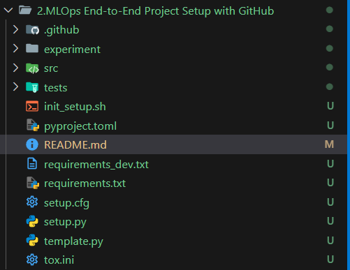

Create a GitHub repo and open any code editor [VS-Code].

Once open in VsCode the follow following steps:

Ctrl + Shift + P then Select Git:Clone and Pate the GitHub repo Like It will more HelpFull.

Source ------------ Pipeline ------------> Destigination

From Source to Destigination is called Pipeline.

[MLOPs Flow](https://res.cloudinary.com/canonical/image/fetch/f_auto,q_auto,fl_sanitize,c_fill,w_1082/https%3A%2F%2Fubuntu.com%2Fwp-content%2Fuploads%2Fc74e%2Fmlops.jpg)

Go through the Project setup

Running the file template.py will help to setup fodler / project easy..

what is the Usages of Each folder and file:

-----------------------------------------------------

.github/ - Contains GitHub-specific configurations like CI/CD workflows, issue templates, and GitHub Actions for automated testing, deployment, and MLOps pipelines.

-----------------------------------------------------

experiment/ - Houses experimental notebooks, exploratory data analysis (EDA), and prototype code. Keeps research separate from production code.

-----------------------------------------------------

src/ - Contains the main source code for your ML application. This is your production-ready, modular, reusable code (data processing, model training, inference, etc.).

-----------------------------------------------------
tests/ - Holds unit tests, integration tests, and validation scripts to ensure code quality and catch bugs early in the development cycle.
📄 Files

-----------------------------------------------------
init_setup.sh - Shell script to automate initial project setup (creating virtual environments, installing dependencies, setting up pre-commit hooks, etc.).

-----------------------------------------------------
pyproject.toml - Modern Python project configuration file (PEP 518). Defines project metadata, dependencies, build system, and tool configurations (replaces setup.py in many cases).

-----------------------------------------------------
README.md - Project documentation explaining what the project does, how to set it up, and how to use it. Essential for collaboration.

-----------------------------------------------------
requirements_dev.txt - Development dependencies (testing tools, linters, formatters like pytest, black, flake8) separate from production requirements.

-----------------------------------------------------
requirements.txt - Production dependencies needed to run the ML application.

-----------------------------------------------------
setup.cfg - Configuration for various Python tools (flake8, pytest, mypy). Centralizes tool settings.

-----------------------------------------------------
setup.py - Python package installation script. Makes your src/ code installable as a package (pip install -e .).

-----------------------------------------------------

template.py - Likely a script to auto-generate this project structure, making it easy to start new MLOps projects with the same organization.

-----------------------------------------------------
tox.ini - Configuration for Tox, which automates testing across multiple Python environments to ensure compatibility.

-----------------------------------------------------